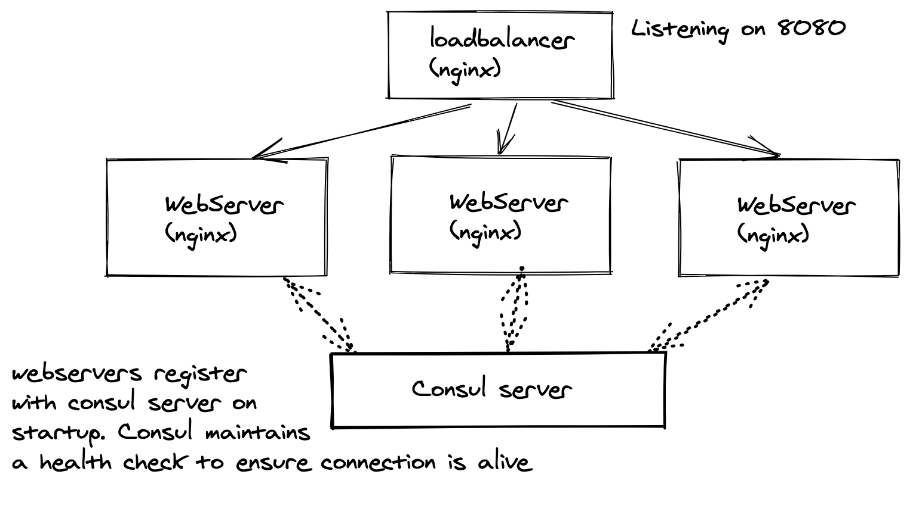

# Deploy HA Webservers

### Purpose

Ensure we have highly available webservers
 1. Webservers should be scale-able to any number of containers
 2. Loadbalancer should only route to active containers
 3. Maintain a health-check of the active webservers
 4. webservers should return list of all the active and running of its own and other webservers in the pool. 

Below is an overall architecture of what we are trying to accomplish.




### Installing the services

#### Pre-Reqs
1. You have latest Docker and docker-compose installed on your machine. 

#### Starting the service

From the repo, just do the following:
```
docker-compose up --build -d
```

#### Scaling the service
By default, we only have 1 instance of the webserver running. 
If you would like to scale the service, you can do the following:
```
docker-compose scale webserver=<N>
	where N is any arbitrary integer >= 1
	e.g. If you would like 10 instances of the webservers, you can do the following:
	docker-compose scale webserver=10
```

#### Verification
You can open your browser and point to the following url:
`http://localhost:8080/`

The loaded webpage would show the `local` IPs of the running webserver containers. 

If you like, you can manually tear down any of the running webservers, and refresh your browser page. It should reflect ONLY the active and running docker containers. 

### De-Install the services 

All you need to do for cleanup is:
```
docker-compose down
```
This will stop all the containers, and destroy any local networks created by docker-compose. 


